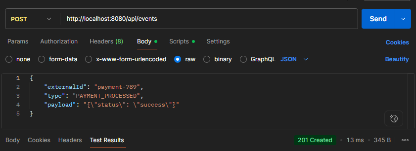
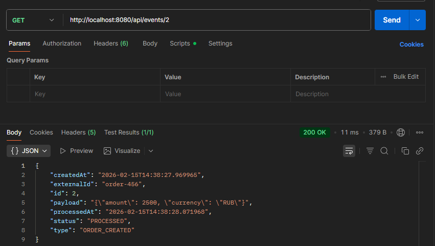
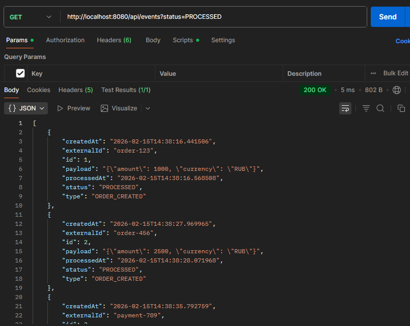
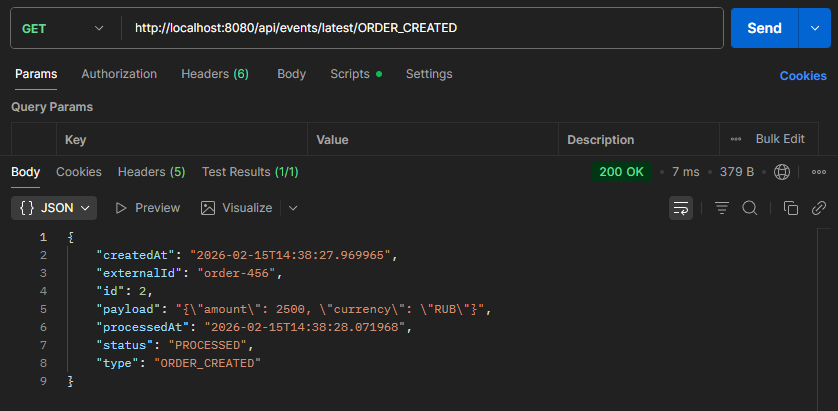
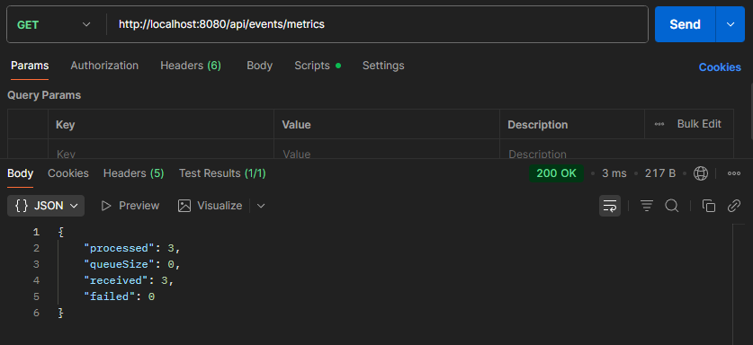

## Event Service

----

## Запуск проекта
1. **Клонировать репозиторий**
```bash
git clone https://github.com/Max1m3L/EventService
```
2. **Создать БД "eventdb" в Postgres и указать свой логин и пароль в [properties](src/main/resources/application.properties) файле**
3. **Запустить [EventTasksApplication](src/main/java/com/maxlvsh/eventtasks/EventTasksApplication.java)**

----

### Основные компоненты:
- **Producer** ([EventService](src/main/java/com/maxlvsh/eventtasks/service/EventService.java)) - сохраняет событие в БД и кладёт в очередь
- **Consumers** ([EventConsumer](src/main/java/com/maxlvsh/eventtasks/service/EventConsumer.java)) - пул потоков, обрабатывающих события
- **File Logger** - дублирует результаты обработки в [файл](/event-log.txt) 
- **Cleanup Service** - удаляет старые записи по расписанию

----

## API Endpoints

1) POST http://localhost:8080/api/events - создать event
2) GET http://localhost:8080/api/events - получить все event
3) GET http://localhost:8080/api/events/{id} - получить по id
4) GET http://localhost:8080/api/events/metrics - метрики
5) GET http://localhost:8080/api/events/latest/{type} - свой query-запрос на последнее обработанное событие по типу

---

## Скриншоты работы
1. **Создание **
2. **Получение **
3. **Получение по статусу**
4. **Получение последнего**
5. **Валидация **
6. **Метрики **

p.s. сначала написал всё с Lombok, но почему-то какая-то несовместимость произошла и переписал на классические сеттеры/геттеры:)


